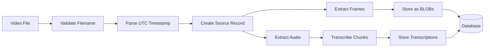

# Architecture

## Design Principles

1. **Capture First, Process Later**: The system captures raw data (frames and transcriptions) with UTC timestamps. Any analysis happens separately on stored data.

2. **Strict Input Format**: Videos must follow `YYYY-MM-DD_HH-MM-SS.mp4` naming to ensure reliable timestamp extraction.

3. **Self-Contained Database**: Images stored as BLOBs, not file paths, making the database portable and self-contained.

4. **UTC Everywhere**: All timestamps are absolute UTC, never relative to video start.

## System Components

```
mem/
├── src/
│   ├── capture/           # Data extraction
│   │   ├── extractor.py   # Frame extraction, timestamp parsing
│   │   ├── transcriber.py # Whisper audio transcription
│   │   └── pipeline.py    # Processing orchestration
│   │
│   ├── storage/           # Database layer
│   │   ├── db.py         # SQLite operations
│   │   ├── models.py     # Pydantic data models
│   │   └── schema.sql    # Database schema
│   │
│   └── cli_new.py        # Command-line interface
│
├── scripts/              # Utility scripts
│   └── create_test_video.py
│
└── data/                 # Runtime data
    └── mem.db           # SQLite database
```

## Data Flow



## Database Schema

### Core Tables

**sources**
- Tracks video files and streams
- Stores start/end UTC timestamps
- Records duration and frame count

**frames**
- Stores extracted frames as JPEG BLOBs
- Each frame has absolute UTC timestamp
- Includes dimensions and size metadata

**transcriptions**
- Stores text from audio transcription
- Time ranges in UTC
- Includes confidence and language

### Future Tables

**frame_analysis**
- Results from vision models
- Descriptions, objects detected, etc.

**transcript_analysis**
- Summaries, topics, entities
- Semantic analysis results

## Processing Pipeline

### 1. Filename Validation
```python
# Must match: YYYY-MM-DD_HH-MM-SS.mp4
parse_video_timestamp("2025-08-22_14-30-45.mp4")
# Returns: datetime(2025, 8, 22, 14, 30, 45, tzinfo=UTC)
```

### 2. Frame Extraction
- Default: 1 frame every 5 seconds
- Converts to JPEG (quality 85)
- Stores as BLOB with UTC timestamp

### 3. Audio Transcription
- Chunks audio into 5-minute segments
- Uses OpenAI Whisper (base model default)
- Stores with start/end UTC timestamps

## Configuration

Currently hardcoded, planned config.yaml:
```yaml
capture:
  frame_interval: 5      # seconds
  chunk_duration: 300    # 5 minutes
  image_quality: 85      # JPEG quality

whisper:
  model: "base"
  language: "auto"

storage:
  database_path: "mem.db"
  max_image_size: 5242880  # 5MB
```

## Separation of Concerns

### Capture Layer (Current)
- Extract frames and audio
- Store raw data with timestamps
- No analysis or interpretation

### Processing Layer (Future)
- Read stored frames/transcriptions
- Apply vision/language models
- Store analysis results separately

### API Layer (Planned)
- REST endpoints for queries
- Time-based data retrieval
- Trigger processing jobs

## Performance Considerations

- **Frame Storage**: ~100-200KB per frame (JPEG quality 85)
- **5-second intervals**: 720 frames per hour = ~100MB
- **Transcription**: Minimal storage, high value
- **Database Growth**: ~2.4GB per 24 hours of video

## Security & Privacy

- All data stored locally
- No cloud dependencies for capture
- Optional AI processing can be local (Ollama) or cloud
- Database can be encrypted at filesystem level