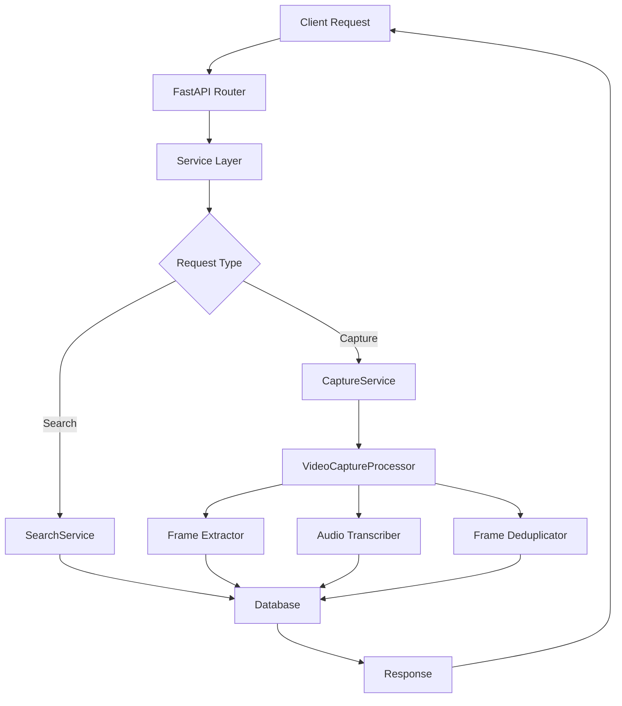
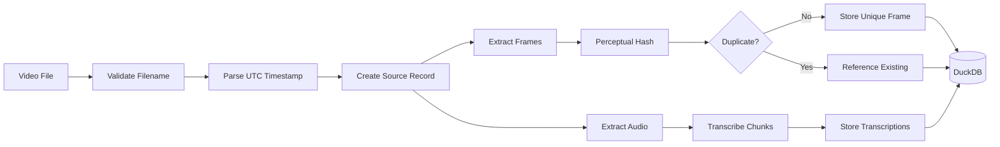

# Architecture

## Design Principles

1. **Capture First, Process Later**: The system captures raw data (frames and transcriptions) with UTC timestamps. Any analysis happens separately on stored data.

2. **Strict Input Format**: Videos must follow `YYYY-MM-DD_HH-MM-SS.mp4` naming to ensure reliable timestamp extraction.

3. **Self-Contained Database**: Images stored as BLOBs with perceptual hashing for ~90% storage reduction.

4. **UTC Everywhere**: All timestamps are absolute UTC, never relative to video start.

5. **API-First Design**: REST API provides all functionality for video processing and data retrieval.

## System Components

```
mem/
├── src/
│   ├── api/               # FastAPI backend
│   │   ├── app.py        # Application setup
│   │   ├── routes.py     # API endpoints
│   │   ├── services.py   # Business logic
│   │   └── models.py     # Request/response schemas
│   │
│   ├── capture/           # Data extraction
│   │   ├── extractor.py   # Frame extraction, timestamp parsing
│   │   ├── frame.py       # Perceptual hashing and deduplication
│   │   ├── transcriber.py # STTD client for transcription
│   │   ├── sttd_client.py # HTTP client for STTD service
│   │   ├── stream_server.py # RTMP streaming session management
│   │   └── pipeline.py    # Processing orchestration
│   │
│   ├── storage/           # Database layer
│   │   ├── db.py         # DuckDB operations
│   │   ├── models.py     # Pydantic data models
│   │   └── schema.sql    # Database schema
│   │
│   └── config.py         # Configuration management
│
└── config.yaml           # Configuration file
```

## API Architecture

### Request Flow



### Core API Endpoints

1. **POST /api/capture** - Async video processing
2. **GET /api/search** - Universal data access
3. **GET /api/status** - System monitoring

The `/api/search` endpoint uses a type parameter to handle all data retrieval:
- `type=timeline` - Temporal data with frames and transcripts
- `type=frame` - Direct frame image access
- `type=transcript` - Text search in transcriptions
- `type=all` - Combined search

## Data Flow



## Database Schema (DuckDB)

### Core Tables

**sources**
- Tracks video files and future streams
- Stores start/end UTC timestamps
- Records metadata (fps, dimensions, codec)

**unique_frames**
- Deduplicated frames with perceptual hashing
- Stores extracted frames as JPEG BLOBs
- Each frame has first/last seen timestamps
- ~90% storage reduction through deduplication

**timeline**
- Maps every timestamp to frames and transcriptions
- Links to unique_frames table
- Tracks similarity scores for scene detection

**transcriptions**
- Stores text from audio transcription
- Time ranges in UTC
- Includes confidence and language

### Deduplication Strategy

```sql
-- Perceptual hashing enables efficient deduplication
SELECT COUNT(*) as total_references,
       COUNT(DISTINCT frame_id) as unique_frames,
       (1 - COUNT(DISTINCT frame_id)::FLOAT / COUNT(*))*100 as dedup_percentage
FROM timeline;
-- Typical result: 95% deduplication
```

## Processing Pipeline

### 1. Filename Validation
```python
# Must match: YYYY-MM-DD_HH-MM-SS.mp4
parse_video_timestamp("2025-08-22_14-30-45.mp4")
# Returns: datetime(2025, 8, 22, 14, 30, 45, tzinfo=UTC)
```

### 2. Frame Extraction & Deduplication
- Default: 1 frame every 5 seconds
- Converts to JPEG (quality 85)
- Generates perceptual hash (dhash)
- Compares with previous frame (95% similarity threshold)
- Stores unique frames only

### 3. Audio Transcription
- Chunks audio into 60-second segments with 5-second overlap
- Sends to STTD service (speech-to-text daemon)
- Speaker diarization and identification
- Stores with start/end UTC timestamps
- Includes confidence scores and speaker info

## Configuration

Via `config.yaml`:
```yaml
database:
  path: "mem.duckdb"

sttd:
  host: "nightman.tap"       # STTD server host
  port: 8765                 # STTD server port
  timeout: 300.0             # Request timeout
  identify_speakers: true    # Enable speaker identification

capture:
  frame:
    interval_seconds: 5      # Frame extraction interval
    jpeg_quality: 85         # JPEG compression quality
  audio:
    chunk_duration_seconds: 60   # 1-minute chunks
    overlap_seconds: 5           # Overlap between chunks

api:
  host: "0.0.0.0"
  port: 8000
  max_upload_size: 5368709120  # 5GB
```

## Separation of Concerns

### API Layer
- REST endpoints for all operations
- Request validation
- Response formatting
- Error handling

### Service Layer
- Business logic
- Job management
- Query orchestration
- Format conversion

### Capture Layer
- Extract frames and audio
- Store raw data with timestamps
- No analysis or interpretation
- Perceptual hashing for deduplication

### Storage Layer
- DuckDB for time-series optimization
- BLOB storage for frames
- Efficient temporal queries
- Statistics and aggregations

### Processing Layer (Future)
- Read stored frames/transcriptions
- Apply vision/language models
- Store analysis results separately

## Performance Characteristics

### Storage Efficiency
- **Raw Storage**: ~100-200KB per frame (JPEG quality 85)
- **After Deduplication**: ~5-10KB per frame (95% reduction)
- **5-second intervals**: 720 frames/hour = ~5-10MB (vs 100MB raw)
- **Transcription**: Minimal storage, high value
- **Database Growth**: ~120MB per 24 hours (vs 2.4GB raw)

### Query Performance
- **DuckDB Advantages**:
  - Columnar storage for fast aggregations
  - Native time-series functions (TIME_BUCKET)
  - Efficient BLOB handling
  - Parallel query execution

### API Performance
- **Async Processing**: Non-blocking video capture
- **In-Memory Jobs**: Fast job status tracking
- **Image Caching**: Browser cache for frames
- **Pagination**: Efficient large dataset handling

## Security & Privacy

- All data stored locally
- No cloud dependencies for capture
- No authentication (current version)
- Database can be encrypted at filesystem level
- STTD runs on your network (no external API calls)

## Streaming Support

### RTMP Architecture
- nginx-rtmp receives streams from OBS Studio
- Stream validation via HTTP callbacks to backend
- exec_push runs stream_handler.py for frame extraction
- Frames POSTed to backend API for storage

### Stream Flow
```
OBS -> nginx-rtmp:1935 -> HTTP callbacks -> mem-backend
                       -> exec_push -> stream_handler.py -> POST frames -> mem-backend
```

## Future Enhancements

### Analysis Pipeline
- Vision model integration (CLIP, YOLO)
- Semantic search on visual content
- Scene understanding
- Activity detection

### Scalability
- Distributed processing
- S3-compatible storage
- PostgreSQL option
- Horizontal scaling