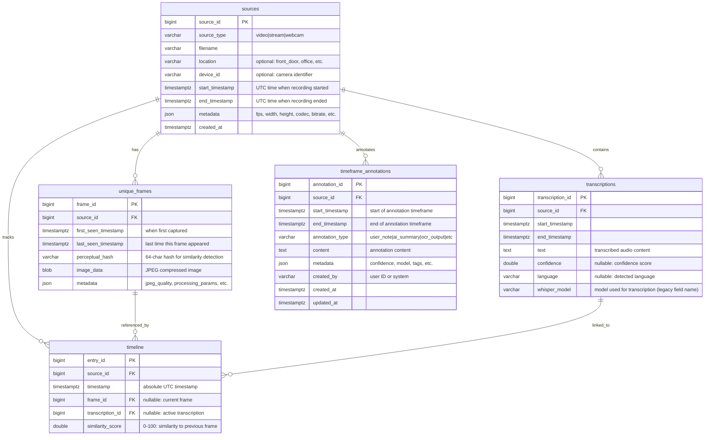

# Database Schema

## Overview

The Mem database uses DuckDB for efficient time-series storage of video frames and transcriptions. The schema is optimized for:
- **Storage efficiency**: ~90% reduction through frame deduplication
- **Temporal queries**: Native time-series functions and indexing
- **Computed fields**: Values calculated on-demand to reduce redundancy

## Entity Relationship Diagram



## Tables

### sources
Root entity for all capture sessions (videos, streams, webcam captures).

| Column | Type | Description |
|--------|------|-------------|
| source_id | BIGINT | Primary key |
| source_type | VARCHAR | Type: 'video', 'stream', or 'webcam' |
| filename | VARCHAR | Original filename |
| location | VARCHAR | Optional: Physical location (e.g., 'front_door') |
| device_id | VARCHAR | Optional: Camera identifier |
| start_timestamp | TIMESTAMPTZ | UTC timestamp when recording started |
| end_timestamp | TIMESTAMPTZ | UTC timestamp when recording ended |
| metadata | JSON | Video metadata (fps, width, height, codec, etc.) |
| created_at | TIMESTAMPTZ | When record was created |

### unique_frames
Deduplicated frame storage using perceptual hashing. Reduces storage by ~90% for static scenes.

| Column | Type | Description |
|--------|------|-------------|
| frame_id | BIGINT | Primary key |
| source_id | BIGINT | Foreign key to sources |
| first_seen_timestamp | TIMESTAMPTZ | When frame was first captured |
| last_seen_timestamp | TIMESTAMPTZ | Last time this frame appeared |
| perceptual_hash | VARCHAR(64) | Hash for similarity detection |
| image_data | BLOB | JPEG compressed image |
| metadata | JSON | Contains jpeg_quality, processing params, etc. |

### timeline
Maps every timestamp to its corresponding frame and transcription data. Central temporal index.

| Column | Type | Description |
|--------|------|-------------|
| entry_id | BIGINT | Primary key |
| source_id | BIGINT | Foreign key to sources |
| timestamp | TIMESTAMPTZ | Absolute UTC timestamp |
| frame_id | BIGINT | Foreign key to unique_frames (nullable) |
| transcription_id | BIGINT | Foreign key to transcriptions (nullable) |
| similarity_score | DOUBLE | 0-100: similarity to previous frame |

### transcriptions
Audio-to-text segments with time ranges.

| Column | Type | Description |
|--------|------|-------------|
| transcription_id | BIGINT | Primary key |
| source_id | BIGINT | Foreign key to sources |
| start_timestamp | TIMESTAMPTZ | Start of transcription segment |
| end_timestamp | TIMESTAMPTZ | End of transcription segment |
| text | TEXT | Transcribed text content |
| confidence | DOUBLE | Optional: confidence score |
| language | VARCHAR(10) | Optional: detected language |
| whisper_model | VARCHAR | Model used (default: 'base') - legacy field name, now stores STTD model |

### timeframe_annotations
User and AI-generated annotations for specific timeframes. Allows adding context, notes, summaries, and analysis results without modifying the original captured data.

| Column | Type | Description |
|--------|------|-------------|
| annotation_id | BIGINT | Primary key |
| source_id | BIGINT | Foreign key to sources |
| start_timestamp | TIMESTAMPTZ | Start of annotation timeframe |
| end_timestamp | TIMESTAMPTZ | End of annotation timeframe |
| annotation_type | VARCHAR | Type: user_note, ai_summary, ocr_output, llm_query, scene_description, action_detected, custom |
| content | TEXT | Annotation content |
| metadata | JSON | Optional: confidence scores, model info, tags, etc. |
| created_by | VARCHAR | User ID or 'system' (default: 'system') |
| created_at | TIMESTAMPTZ | When annotation was created |
| updated_at | TIMESTAMPTZ | Last update time |

**Annotation Types:**
- `user_note`: Manual user annotations
- `ai_summary`: AI-generated summaries of timeframe content
- `ocr_output`: Text extracted from frames via OCR
- `llm_query`: Results from LLM analysis
- `scene_description`: Visual scene descriptions
- `action_detected`: Detected actions or events
- `custom`: User-defined annotation types

## Computed Fields

Several fields are now computed on-demand rather than stored, reducing redundancy and maintenance overhead:

### Computed from sources
- `duration_seconds`: Calculated as `end_timestamp - start_timestamp`
- `fps`, `width`, `height`: Extracted from metadata JSON

### Computed from unique_frames
- `size_bytes`: Calculated as `LENGTH(image_data)`
- `reference_count`: Count of timeline entries referencing this frame
- `width`, `height`: Retrieved from source's metadata

### Computed from timeline
- `scene_changed`: Derived as `similarity_score < 95.0`

### Computed from transcriptions
- `word_count`: Calculated from text field

## Indexes

### Performance Indexes
```sql
-- Timeline temporal queries
CREATE INDEX idx_timeline_temporal ON timeline(timestamp, source_id);
CREATE INDEX idx_timeline_source ON timeline(source_id, timestamp);
CREATE INDEX idx_timeline_similarity ON timeline(source_id, similarity_score, timestamp);

-- Frame lookups
CREATE INDEX idx_frames_hash ON unique_frames(source_id, perceptual_hash);
CREATE INDEX idx_frames_temporal ON unique_frames(source_id, first_seen_timestamp);

-- Transcription queries
CREATE INDEX idx_trans_temporal ON transcriptions(start_timestamp, end_timestamp);
CREATE INDEX idx_trans_source ON transcriptions(source_id, start_timestamp);
```

## Views

### Computed Views for Backward Compatibility

#### sources_with_computed
Provides computed duration and extracted metadata fields:
```sql
SELECT 
    s.*,
    EXTRACT(EPOCH FROM (s.end_timestamp - s.start_timestamp)) as duration_seconds,
    s.metadata->>'$.fps' as fps,
    s.metadata->>'$.width' as width,
    s.metadata->>'$.height' as height
FROM sources s;
```

#### frames_with_computed
Provides computed size and reference count:
```sql
SELECT 
    f.*,
    LENGTH(f.image_data) as size_bytes,
    (SELECT COUNT(*) FROM timeline t WHERE t.frame_id = f.frame_id) as reference_count,
    s.metadata->>'$.width' as width,
    s.metadata->>'$.height' as height,
    f.metadata->>'$.jpeg_quality' as jpeg_quality
FROM unique_frames f
JOIN sources s ON f.source_id = s.source_id;
```

#### transcriptions_with_computed
Provides computed word count:
```sql
SELECT 
    t.*,
    array_length(string_split(t.text, ' '), 1) as word_count
FROM transcriptions t;
```

#### timeline_with_computed
Provides computed scene_changed flag:
```sql
SELECT 
    t.*,
    CASE WHEN t.similarity_score < 95.0 THEN TRUE ELSE FALSE END as scene_changed
FROM timeline t;
```

### Analytical Views

#### current_state
Shows the current state for active sources with latest frame and transcription.

#### scene_changes
Identifies scene changes based on similarity score threshold (< 95.0).

#### deduplication_stats
Provides deduplication statistics per source showing storage savings.

## Design Principles

### 1. Temporal First
All data is anchored to absolute UTC timestamps, enabling efficient time-based queries and temporal joins.

### 2. Deduplication
Perceptual hashing reduces storage by ~90% for static scenes while maintaining visual quality.

### 3. Separation of Concerns
- **Capture**: Raw data storage (frames, transcriptions)
- **Analysis**: Separate tables for future ML/AI processing
- **Presentation**: Computed views for queries

### 4. Storage Efficiency
- Computed fields reduce redundancy
- JSON metadata for flexible schema evolution
- BLOB storage keeps database self-contained

## Migration Notes

When migrating from the old schema:
1. Move `fps`, `width`, `height` from sources columns to metadata JSON
2. Remove `duration_seconds`, `size_bytes`, `reference_count`, `word_count` columns
3. Remove `scene_changed` column from timeline
4. Move frame dimensions and quality to metadata JSON
5. Use computed views for backward compatibility